# Static model (MVP) — worker_llm_client

Implementation target: Python 3.13+

### 1) Clarifying questions (if needed)

No questions

### 2) Contexts and Python modules

#### Context: Workflow Execution

- Context name: Workflow Execution
- Purpose: Represent `flow_runs/{runId}` + step lifecycle rules, and decide which `LLM_REPORT` step is executable/claimable for this worker.
- Python package/module path:
  - `worker_llm_client/workflow/domain.py`
  - `worker_llm_client/workflow/policies.py`
- Classes:

| Class | Type | Notes |
| --- | --- | --- |
| `FlowRun` | Entity | Aggregate root for `flow_runs/{runId}` |
| `FlowStep` | Entity | Generic step model (all `stepType`s) |
| `LLMReportStep` | Entity | Typed wrapper over `FlowStep` (`stepType=LLM_REPORT`) |
| `LLMReportInputs` | Value Object | Validated view of `LLM_REPORT.inputs` |
| `StepError` | Value Object | `steps.<stepId>.error` payload (`code/message/details`) |
| `ErrorCode` | Enum | Stable error codes for this worker |
| `ReadyStepSelector` | Domain Service | Deterministically selects executable READY `LLM_REPORT` step |

#### Context: Report Generation (LLM)

- Context name: Report Generation (LLM)
- Purpose: Resolve prompt + structured-output schema, assemble context, call Gemini (AI Studio), validate/repair structured output, and produce the `LLMReportFile` artifact.
- Python package/module path:
  - `worker_llm_client/reporting/domain.py`
  - `worker_llm_client/reporting/services.py`
- Classes:

| Class | Type | Notes |
| --- | --- | --- |
| `LLMPrompt` | DTO / Value Object | Firestore `llm_prompts/{promptId}` |
| `LLMSchema` | DTO / Value Object | Firestore `llm_schemas/{schemaId}` registry record |
| `LLMProfile` | Value Object | Effective request profile from step inputs (authoritative) |
| `StructuredOutputSpec` | Value Object | `schemaId/kind/schemaSha256?` (hash informational-only) |
| `UserInputAssembler` | Service | Builds the `## UserInput` section from resolved artifacts |
| `StructuredOutputValidator` | Service | Extract → parse → JSON Schema validate (+ minimal invariants) |
| `StructuredOutputInvalid` | Value Object | Sanitized validation failure summary for logs/errors |
| `LLMReportFile` | DTO | Worker-owned `metadata` + model-owned `output` |

#### Context: Artifacts (GCS)

- Context name: Artifacts (GCS)
- Purpose: Deterministic artifact naming, loading upstream context artifacts, and writing the report artifact idempotently (create-only semantics).
- Python package/module path:
  - `worker_llm_client/artifacts/domain.py`
  - `worker_llm_client/artifacts/services.py`
- Classes:

| Class | Type | Notes |
| --- | --- | --- |
| `GcsUri` | Value Object | `gs://bucket/path` |
| `ArtifactPathPolicy` | Policy | Deterministic `/<runId>/<timeframe>/<stepId>.json` |
| `ArtifactStore` | Adapter (port) | Read/write objects by `GcsUri` |
| `GcsArtifactStore` | Adapter (impl) | Cloud Storage implementation |

#### Context: Application + Infrastructure

- Context name: Application + Infrastructure
- Purpose: CloudEvent entrypoint orchestration and concrete adapters (Firestore, Gemini AI Studio, Cloud Logging).
- Python package/module path:
  - `worker_llm_client/app/handler.py`
  - `worker_llm_client/app/services.py`
  - `worker_llm_client/infra/firestore.py`
  - `worker_llm_client/infra/gemini.py`
  - `worker_llm_client/infra/cloudevents.py`
  - `worker_llm_client/ops/logging.py`
  - `worker_llm_client/ops/config.py`
  - `worker_llm_client/ops/time_budget.py`
- Classes:

| Class | Type | Notes |
| --- | --- | --- |
| `FlowRunEventHandler` | Application Service | End-to-end handler for one Firestore update CloudEvent |
| `CloudEventParser` | Service | Extract/validate `runId` from CloudEvent `subject` |
| `FlowRunRepository` | Repository (port) | Load + patch flow_run with optimistic preconditions |
| `FirestoreFlowRunRepository` | Repository (impl) | Firestore implementation (update_time preconditions) |
| `ClaimResult` | Value Object | Claim outcome (`claimed/status/reason`) for `READY → RUNNING` |
| `FinalizeResult` | Value Object | Finalize outcome (`updated/status/reason`) for `RUNNING → SUCCEEDED/FAILED` |
| `PromptRepository` | Repository (port) | Fetch `LLMPrompt` |
| `FirestorePromptRepository` | Repository (impl) | Firestore implementation |
| `SchemaRepository` | Repository (port) | Fetch `LLMSchema` |
| `FirestoreSchemaRepository` | Repository (impl) | Firestore implementation |
| `LLMClient` | Client (port) | Generate content (Gemini-like API) |
| `GeminiClientAdapter` | Client (impl) | Gemini AI Studio adapter |
| `EventLogger` | Adapter (port) | Structured log events (`jsonPayload.event`) |
| `CloudLoggingEventLogger` | Adapter (impl) | Python `logging` JSON envelope |
| `GeminiApiKey` | Value Object | Single Gemini API key from `GEMINI_API_KEY` (never log) |
| `GeminiAuthConfig` | Value Object | Auth mode + API key (never logs key) |
| `WorkerConfig` | Value Object | Validated env config |
| `TimeBudgetPolicy` | Policy | Enforces finalize budget + external call cutoffs |

### 3) Class registry (full list)

| Class | Context/Module | Type | Key responsibility | Related artifacts/scenarios |
| --- | --- | --- | --- | --- |
| `FlowRun` | Workflow / `workflow/domain.py` | Entity | Model `flow_runs/{runId}` for selection/execution | `contracts/flow_run.schema.json`, Scenario A/B (`spec/implementation_contract.md`) |
| `FlowStep` | Workflow / `workflow/domain.py` | Entity | Model step state + edges | `contracts/flow_run.schema.json` |
| `LLMReportStep` | Workflow / `workflow/domain.py` | Entity | Typed wrapper for `LLM_REPORT` | Scenario B (`spec/implementation_contract.md`) |
| `LLMReportInputs` | Workflow / `workflow/domain.py` | Value Object | Validate/hold `LLM_REPORT.inputs.*` | `contracts/flow_run.schema.json`, `test_vectors/inputs/flow_run.ready_llm_report.json` |
| `StepError` | Workflow / `workflow/domain.py` | Value Object | Sanitized failure payload | `spec/error_and_retry_model.md` |
| `ErrorCode` | Workflow / `workflow/domain.py` | Enum | Stable error code set | `spec/error_and_retry_model.md` |
| `ReadyStepSelector` | Workflow / `workflow/policies.py` | Domain Service | Select executable READY step deterministically | Scenario A/B (`spec/implementation_contract.md`) |
| `LLMPrompt` | Reporting / `reporting/domain.py` | DTO | Prompt instruction texts | `contracts/llm_prompt.schema.json`, `spec/prompt_storage_and_context.md` |
| `LLMSchema` | Reporting / `reporting/domain.py` | DTO | Structured output schema registry record | `contracts/llm_schema.schema.json`, schema rules (`spec/implementation_contract.md`) |
| `LLMProfile` | Reporting / `reporting/domain.py` | Value Object | Effective request config (authoritative) | `spec/implementation_contract.md` (LLM request parameters) |
| `StructuredOutputSpec` | Reporting / `reporting/domain.py` | Value Object | Structured-output requirement | `contracts/llm_schema.md`, `contracts/examples/llm_schema.example.json` |
| `UserInputAssembler` | Reporting / `reporting/services.py` | Service | Assemble UserInput section (scope + artifacts) | `spec/prompt_storage_and_context.md` |
| `StructuredOutputValidator` | Reporting / `reporting/services.py` | Service | Validate structured output deterministically | `spec/implementation_contract.md`, fixtures under `fixtures/structured_output_invalid/*` |
| `StructuredOutputInvalid` | Reporting / `reporting/domain.py` | Value Object | Safe structured-output failure summary | `spec/observability.md` (`structured_output_invalid`) |
| `LLMReportFile` | Reporting / `reporting/domain.py` | DTO | Canonical report artifact shape | `contracts/llm_report_file.schema.json` |
| `GcsUri` | Artifacts / `artifacts/domain.py` | Value Object | Strongly-typed `gs://` URI | `spec/system_integration.md` |
| `ArtifactPathPolicy` | Artifacts / `artifacts/domain.py` | Policy | Deterministic artifact URI derivation | Artifact naming (`spec/implementation_contract.md`) |
| `ArtifactStore` | Artifacts / `artifacts/services.py` | Adapter (port) | Read/write artifacts by URI | Idempotency rules (`spec/error_and_retry_model.md`) |
| `GcsArtifactStore` | Infra / `infra/gcs.py` | Adapter (impl) | Cloud Storage I/O | `spec/error_and_retry_model.md` |
| `CloudEventParser` | Infra / `infra/cloudevents.py` | Service | Parse runId from CloudEvent subject | CloudEvent parsing (`spec/implementation_contract.md`) |
| `FlowRunRepository` | App / `app/services.py` | Repository (port) | Load + patch flow_run with preconditions | Claim/finalize (`spec/architecture_overview.md`) |
| `FirestoreFlowRunRepository` | Infra / `infra/firestore.py` | Repository (impl) | Firestore implementation (update_time precondition) | Claim/finalize (`spec/implementation_contract.md`) |
| `ClaimResult` | Infra / `infra/firestore.py` | Value Object | Result of `READY → RUNNING` claim attempt | Recommended implementation (`spec/implementation_contract.md`) |
| `FinalizeResult` | Infra / `infra/firestore.py` | Value Object | Result of `RUNNING → SUCCEEDED/FAILED` finalize attempt | Recommended implementation (`spec/implementation_contract.md`) |
| `PromptRepository` | App / `app/services.py` | Repository (port) | Fetch prompt doc | `spec/prompt_storage_and_context.md` |
| `FirestorePromptRepository` | Infra / `infra/firestore.py` | Repository (impl) | Firestore `llm_prompts/{promptId}` | Missing prompt vector (`test_vectors/inputs/flow_run.ready_llm_report_missing_prompt.json`) |
| `SchemaRepository` | App / `app/services.py` | Repository (port) | Fetch schema doc | Schema registry (`spec/implementation_contract.md`) |
| `FirestoreSchemaRepository` | Infra / `infra/firestore.py` | Repository (impl) | Firestore `llm_schemas/{schemaId}` | `contracts/llm_schema.schema.json` |
| `LLMClient` | App / `app/services.py` | Client (port) | Provider-neutral generate interface | `spec/architecture_overview.md` |
| `GeminiClientAdapter` | Infra / `infra/gemini.py` | Client (impl) | Gemini AI Studio call adapter | `spec/implementation_contract.md` (AI Studio MVP) |
| `EventLogger` | Ops / `ops/logging.py` | Adapter (port) | Structured event logging API | `spec/observability.md` |
| `CloudLoggingEventLogger` | Ops / `ops/logging.py` | Adapter (impl) | Emit JSON logs with stable taxonomy | `spec/observability.md` |
| `GeminiApiKey` | Ops / `ops/config.py` | Value Object | Single Gemini API key parsed from `GEMINI_API_KEY` | `spec/deploy_and_envs.md` (Gemini API key management) |
| `GeminiAuthConfig` | Ops / `ops/config.py` | Value Object | Selected Gemini auth config (mode + key id) | `spec/deploy_and_envs.md`, `spec/observability.md` |
| `WorkerConfig` | Ops / `ops/config.py` | Value Object | Env config validation | `spec/deploy_and_envs.md` |
| `TimeBudgetPolicy` | Ops / `ops/time_budget.py` | Policy | Enforce finalize reserve + deadlines | Timeout policy (`spec/implementation_contract.md`) |
| `FlowRunEventHandler` | App / `app/handler.py` | Application Service | Orchestrate end-to-end invocation | Scenario A/B + edge cases (`spec/implementation_contract.md`) |

### 4) Class descriptions

**4.1 FlowRun**
- Conceptual:
  - Meaning in the domain: A workflow run for a symbol, containing a step graph and run-level status. It is the worker’s source of truth for selecting and finalizing one `LLM_REPORT` step.
  - Invariants/rules:
    - The worker executes only when `status == RUNNING`.
    - Extra/unknown fields may exist in Firestore; the worker ignores them.
  - Main states/attributes (meaning):
    - Run identity, flow key, scope (symbol), run status, steps map, timestamps, optional run error.
- Specification-level:
  - Public API (contracts):
    - `get_step(step_id)` → returns step or signals “not found”.
    - `iter_steps_sorted()` → stable lexicographic order by `stepId`.
    - `is_terminal()` → true if run status is terminal.
  - Exceptions/errors:
    - `FlowRunInvalid` (required subset missing/wrong types).
  - Dependencies:
    - None (domain object).
  - Notes on data flows:
    - Read from Firestore `flow_runs/{runId}`; written via step patches.

**4.2 FlowStep**
- Conceptual:
  - Meaning in the domain: A single workflow node with lifecycle state and dependencies. For this worker, upstream steps exist primarily to provide artifact URIs.
  - Invariants/rules:
    - Worker mutates only the claimed LLM step status (`READY → RUNNING → SUCCEEDED/FAILED`).
  - Main states/attributes (meaning):
    - Step type, status, timeframe, dependency list, inputs, outputs (incl. `gcs_uri`), timestamps, optional error.
- Specification-level:
  - Public API:
    - `is_ready()/is_running()/is_succeeded()/is_failed()`.
    - `depends_on()` → list of `stepId`s.
  - Exceptions/errors:
    - `StepInvalid` (missing required fields for its declared type).
  - Dependencies:
    - None.
  - Notes on data flows:
    - `outputs.gcs_uri` is the worker’s primary pointer to upstream artifacts.

**4.3 LLMReportStep**
- Conceptual:
  - Meaning in the domain: A specialized step representing “generate report via LLM” for one timeframe, with references to prompts, request profile, and upstream artifacts.
  - Invariants/rules:
    - Must not execute unless `status == READY` and dependencies are satisfied.
    - Request profile is authoritative (no merges/overrides).
  - Main states/attributes (meaning):
    - Timeframe, inputs (`promptId`, `llmProfile`, upstream step references), outputs (report `gcs_uri`, execution metadata).
- Specification-level:
  - Public API:
    - `parse_inputs()` → returns `LLMReportInputs`.
  - Exceptions/errors:
    - `InvalidStepInputs` → `INVALID_STEP_INPUTS`.
    - `LLMProfileInvalid` → `LLM_PROFILE_INVALID`.
  - Dependencies:
    - `LLMReportInputs`.
  - Notes on data flows:
    - Drives prompt/schema reads and context artifact resolution via step references.

**4.4 LLMReportInputs**
- Conceptual:
  - Meaning in the domain: A validated snapshot of the execution contract for a single report step.
  - Invariants/rules:
    - `ohlcvStepId` and `chartsManifestStepId` must resolve to steps with `outputs.gcs_uri`, otherwise `INVALID_STEP_INPUTS`.
    - Every `previousReportStepId` must resolve to an `LLM_REPORT` step with `outputs.gcs_uri`, otherwise `INVALID_STEP_INPUTS`.
  - Main states/attributes (meaning):
    - Prompt reference, request profile, upstream artifact step references, optional previous report references.
- Specification-level:
  - Public API:
    - `from_raw(inputs_dict, flow_run)` → validated instance (resolves referenced steps’ output URIs).
  - Exceptions/errors:
    - `InvalidStepInputs`.
  - Dependencies:
    - `LLMProfile`, `GcsUri`.
  - Notes on data flows:
    - Produces the canonical set of input artifact URIs for `LLMReportFile.metadata.inputs`.

**4.5 StepError**
- Conceptual:
  - Meaning in the domain: Worker-owned representation of why a step failed (sanitized).
  - Invariants/rules:
    - Must not contain secrets or raw LLM output.
  - Main states/attributes (meaning):
    - Stable code, short message, optional safe details.
- Specification-level:
  - Public API:
    - `from_error_code(code, message, details=...)`.
  - Exceptions/errors:
    - None (construction should be total for known failures).
  - Dependencies:
    - `ErrorCode`.
  - Notes on data flows:
    - Written into `steps.<stepId>.error`.

**4.6 ErrorCode**
- Conceptual:
  - Meaning in the domain: The stable vocabulary of failure reasons for this worker.
  - Invariants/rules:
    - Must align to `spec/error_and_retry_model.md`.
  - Main states/attributes (meaning):
    - Named code set including `INVALID_STEP_INPUTS`, `LLM_PROFILE_INVALID`, `INVALID_STRUCTURED_OUTPUT`, etc.
- Specification-level:
  - Public API:
    - `is_retryable()` (policy helper).
  - Exceptions/errors:
    - None.
  - Dependencies:
    - None.
  - Notes on data flows:
    - Used in Firestore errors and event logs.

**4.7 ReadyStepSelector**
- Conceptual:
  - Meaning in the domain: Encapsulates selection and “no-op” decisions for this worker under duplicate/reordered events.
  - Invariants/rules:
    - Execute at most one step per invocation; if multiple executable steps exist, choose deterministically.
  - Main states/attributes (meaning):
    - Selection rules: `stepType == LLM_REPORT`, `status == READY`, `dependsOn` all `SUCCEEDED`, run status `RUNNING`.
- Specification-level:
  - Public API:
    - `select_executable_llm_step(flow_run)` → `LLMReportStep | None`.
  - Exceptions/errors:
    - None (no-op result for non-executable state).
  - Dependencies:
    - `FlowRun`, `FlowStep`.
  - Notes on data flows:
    - Drives `cloud_event_noop.reason` (`no_ready_step`, `dependency_not_succeeded`, etc.).

**4.8 LLMPrompt**
- Conceptual:
  - Meaning in the domain: Stored instructions (`systemInstruction` + `userPrompt`) reused across steps/runs.
  - Invariants/rules:
    - No templating in MVP; dynamic values are provided only via generated `## UserInput`.
  - Main states/attributes (meaning):
    - System instruction text, base user prompt text.
- Specification-level:
  - Public API:
    - `render(user_input_text)` → final user content string.
  - Exceptions/errors:
    - `PromptNotFound` → `PROMPT_NOT_FOUND`.
  - Dependencies:
    - None.
  - Notes on data flows:
    - Read from Firestore `llm_prompts/{promptId}`.

**4.9 LLMSchema**
- Conceptual:
  - Meaning in the domain: Registry record for JSON Schema used to validate the model-owned `output` object.
  - Invariants/rules:
    - For `kind=LLM_REPORT_OUTPUT`, the schema must require `output.summary.markdown` and top-level `summary/details`, otherwise it is invalid for MVP.
  - Main states/attributes (meaning):
    - Schema identity, kind, schema JSON, sha256.
- Specification-level:
  - Public API:
    - `provider_schema()` → schema object usable by the Gemini SDK layer.
  - Exceptions/errors:
    - `SchemaNotFound/SchemaInvalid` → `LLM_PROFILE_INVALID`.
  - Dependencies:
    - None.
  - Notes on data flows:
    - Read from Firestore `llm_schemas/{schemaId}`.

**4.10 LLMProfile**
- Conceptual:
  - Meaning in the domain: Effective LLM request parameters (copied into the step by the orchestrator).
  - Invariants/rules:
    - For `LLM_REPORT`, `responseMimeType` must be `application/json` (otherwise invalid).
    - `candidateCount` must be `1` when specified/used (determinism).
  - Main states/attributes (meaning):
    - Model name + generation config + response config + structured output knobs.
- Specification-level:
  - Public API:
    - `validate_for_mvp()` → ensures the profile is executable for this worker.
    - `to_provider_request()` → provider-ready config fragment (sanitized).
  - Exceptions/errors:
    - `LLMProfileInvalid` → `LLM_PROFILE_INVALID`.
  - Dependencies:
    - `StructuredOutputSpec` (optional).
  - Notes on data flows:
    - Read from `steps.<stepId>.inputs.llm.llmProfile`.

**4.11 StructuredOutputSpec**
- Conceptual:
  - Meaning in the domain: Declares that the model must return JSON matching a named schema in the registry.
  - Invariants/rules:
    - `schemaId` must follow `llm_report_output_v{N}` to derive `schemaVersion`.
    - `schemaSha256` (if present in the step) is informational-only in MVP.
  - Main states/attributes (meaning):
    - Kind, schemaId, optional schema hash.
- Specification-level:
  - Public API:
    - `schema_version()` → parse `v{N}` or raise invalid.
  - Exceptions/errors:
    - `LLMProfileInvalid`.
  - Dependencies:
    - `LLMSchema` (resolved at runtime).
  - Notes on data flows:
    - Drives schema lookup and report artifact metadata population (`schemaId` / registry sha256).

**4.12 UserInputAssembler**
- Conceptual:
  - Meaning in the domain: Canonicalizes how artifacts and scope are exposed to the prompt as `## UserInput`.
  - Invariants/rules:
    - Enforce per-artifact size limits (JSON 64KB; chart image 256KB).
    - Previous report resolution is strict (invalid refs → `INVALID_STEP_INPUTS`).
  - Main states/attributes (meaning):
    - Assembly template, size-limit policy.
- Specification-level:
  - Public API:
    - `assemble(flow_run, step, resolved_artifacts)` → user prompt additions (text and/or multimodal parts).
  - Exceptions/errors:
    - `InvalidStepInputs`.
  - Dependencies:
    - None directly (caller supplies resolved artifacts).
  - Notes on data flows:
    - Uses GCS artifact bytes only in-request; does not log raw payloads.

**4.13 StructuredOutputValidator**
- Conceptual:
  - Meaning in the domain: Determines whether the model’s output is acceptable for the contract (JSON parse + JSON Schema validation) without leaking sensitive payload.
  - Invariants/rules:
    - Deterministic extraction: `candidates[0].content.parts[*].text` concatenation; no regex extraction; no trimming.
  - Main states/attributes (meaning):
    - Extraction method, validation rules, minimal-invariants policy.
- Specification-level:
  - Public API:
    - `extract_text(provider_response)` → `(text, extraction_method)`.
    - `validate(text, llm_schema)` → `output_json | StructuredOutputInvalid`.
  - Exceptions/errors:
    - Expected invalid-output cases should yield `StructuredOutputInvalid` (not raw exceptions).
  - Dependencies:
    - `LLMSchema`.
  - Notes on data flows:
    - Emits only safe diagnostics (hash/len + sanitized validation errors).

**4.14 StructuredOutputInvalid**
- Conceptual:
  - Meaning in the domain: Sanitized explanation of why structured output is invalid (for logs + step error message).
  - Invariants/rules:
    - Must not include raw payload excerpts.
  - Main states/attributes (meaning):
    - Kind (`missing_text|json_parse|schema_validation|finish_reason`), message, optional finishReason, diagnostics.
- Specification-level:
  - Public API:
    - `to_step_error_message()` → short sanitized string.
    - `to_log_fields()` → safe structured payload.
  - Exceptions/errors:
    - None.
  - Dependencies:
    - None.
  - Notes on data flows:
    - Used for `structured_output_invalid` logs and final `FAILED` patches.

**4.15 LLMReportFile**
- Conceptual:
  - Meaning in the domain: The canonical report artifact written to GCS (`metadata` + `output`).
  - Invariants/rules:
    - Must conform to `contracts/llm_report_file.schema.json`.
  - Main states/attributes (meaning):
    - Metadata (run/step/scope/model/schema/inputs/timestamps) and output (summary markdown + free-form details).
- Specification-level:
  - Public API:
    - `to_json_bytes()` → stable serialization for upload.
  - Exceptions/errors:
    - `SerializationError` (unexpected).
  - Dependencies:
    - None.
  - Notes on data flows:
    - Written to deterministic GCS path; referenced from Firestore `steps.<stepId>.outputs.gcs_uri`.

**4.16 GcsUri**
- Conceptual:
  - Meaning in the domain: Strongly typed representation of GCS object identifiers used throughout artifact flows.
  - Invariants/rules:
    - Must be `gs://bucket/object`.
  - Main states/attributes (meaning):
    - Bucket and object path.
- Specification-level:
  - Public API:
    - `parse(str)` → `GcsUri`.
    - `__str__()` → canonical `gs://...` form.
  - Exceptions/errors:
    - `InvalidGcsUri`.
  - Dependencies:
    - None.
  - Notes on data flows:
    - Used in Firestore step outputs and report metadata.

**4.17 ArtifactPathPolicy**
- Conceptual:
  - Meaning in the domain: Deterministic artifact naming policy to guarantee idempotency and enable split-brain recovery.
  - Invariants/rules:
    - JSON artifact: `<prefix>/<runId>/<timeframe>/<stepId>.json`.
  - Main states/attributes (meaning):
    - Bucket/prefix configuration.
- Specification-level:
  - Public API:
    - `report_uri(run_id, timeframe, step_id)` → `GcsUri`.
  - Exceptions/errors:
    - `InvalidIdentifier`.
  - Dependencies:
    - `WorkerConfig`.
  - Notes on data flows:
    - Used both for new writes and for “object already exists” recovery checks.

**4.18 ArtifactStore**
- Conceptual:
  - Meaning in the domain: Port for artifact I/O with idempotency semantics.
  - Invariants/rules:
    - Support create-only writes (treat “already exists” as success for deterministic objects).
  - Main states/attributes (meaning):
    - None (interface).
- Specification-level:
  - Public API:
    - `read_bytes(uri)` → bytes (+ safe metadata).
    - `exists(uri)` → bool.
    - `write_bytes_create_only(uri, data, content_type)` → ok/already-exists.
  - Exceptions/errors:
    - `ArtifactReadFailed` / `ArtifactWriteFailed` (retryable at handler level).
  - Dependencies:
    - None (port).
  - Notes on data flows:
    - Reads upstream artifacts; writes report artifact.

**4.19 GcsArtifactStore**
- Conceptual:
  - Meaning in the domain: Cloud Storage implementation of `ArtifactStore`.
  - Invariants/rules:
    - Create-only write uses GCS precondition `ifGenerationMatch=0`.
  - Main states/attributes (meaning):
    - GCS client and request timeout config.
- Specification-level:
  - Public API:
    - Implements `ArtifactStore`.
  - Exceptions/errors:
    - Write failures map to `GCS_WRITE_FAILED` when finalizing.
  - Dependencies:
    - Google Cloud Storage SDK.
  - Notes on data flows:
    - Does not emit raw payloads into logs.

**4.20 CloudEventParser**
- Conceptual:
  - Meaning in the domain: Extracts `runId` from CloudEvent `subject` and ensures it matches the expected pattern.
  - Invariants/rules:
    - Invalid subject/runId → `cloud_event_ignored` and exit without Firestore writes.
  - Main states/attributes (meaning):
    - Collection name and runId regex.
- Specification-level:
  - Public API:
    - `parse_run_id(event)` → `run_id | None` (+ reason).
  - Exceptions/errors:
    - None (invalid input is a no-op).
  - Dependencies:
    - `WorkerConfig`.
  - Notes on data flows:
    - Used before repository reads.

**4.21 FlowRunRepository**
- Conceptual:
  - Meaning in the domain: Port for reading and patching `flow_runs/{runId}` with optimistic preconditions.
  - Invariants/rules:
    - Claim/finalize must use Firestore `update_time` preconditions (no transactions).
    - Parsing is tolerant: ignore unknown fields; validate required subset.
    - Firestore dotted-path updates require a storage-safe `stepId` (must not contain `.`); otherwise FieldPath updates are required and are out of scope for MVP.
  - Main states/attributes (meaning):
    - None (interface).
- Specification-level:
  - Public API:
    - `get(run_id)` → `(FlowRun, update_time) | None`.
    - `patch(run_id, patch, precondition_update_time)` → success/conflict/error (low-level primitive).
    - `claim_step(run_id, step_id, started_at_rfc3339)` → `ClaimResult` (recommended convenience; internally reads snapshot + uses `update_time` precondition).
    - `finalize_step(run_id, step_id, status, finished_at_rfc3339, outputs_gcs_uri?, execution?, error?)` → `FinalizeResult` (recommended convenience; internally reads snapshot + uses `update_time` precondition).
  - Exceptions/errors:
    - `FirestoreUnavailable` for transient errors.
  - Dependencies:
    - None (port).
  - Notes on data flows:
    - Reads/writes Firestore documents only.

**4.22 FirestoreFlowRunRepository**
- Conceptual:
  - Meaning in the domain: Firestore implementation of `FlowRunRepository`.
  - Invariants/rules:
    - Avoid transactions; keep patches minimal; short retries on contention.
    - Claim/finalize operations must be implemented as: read snapshot → validate step status gate → update with `last_update_time` precondition (and short backoff retries on benign precondition/aborted failures).
  - Main states/attributes (meaning):
    - Firestore client, collection name, retry policy.
- Specification-level:
  - Public API:
    - Implements `FlowRunRepository`.
  - Exceptions/errors:
    - Precondition failures surface as benign conflicts.
  - Dependencies:
    - Firestore SDK.
  - Notes on data flows:
    - Implements claim and finalize patches as described in `spec/implementation_contract.md`.

**4.22.1 ClaimResult**
- Conceptual:
  - Meaning in the domain: Represents the outcome of an attempted atomic claim (`READY → RUNNING`).
  - Invariants/rules:
    - Precondition failures are expected under races and are not treated as step failures.
- Specification-level:
  - Fields:
    - `claimed` (bool)
    - `status` (str|None): observed status during the last read
    - `reason` (str|None): `not_ready|precondition_failed`

**4.22.2 FinalizeResult**
- Conceptual:
  - Meaning in the domain: Represents the outcome of an attempted finalization (`RUNNING → SUCCEEDED/FAILED`).
  - Invariants/rules:
    - If the step is already final, do not overwrite (`already_final`).
    - Precondition failures are expected under races (`precondition_failed`).
- Specification-level:
  - Fields:
    - `updated` (bool)
    - `status` (str|None): observed status during the last read
    - `reason` (str|None): `already_final|not_running|precondition_failed`

**4.23 PromptRepository**
- Conceptual:
  - Meaning in the domain: Port for retrieving prompts by `promptId`.
  - Invariants/rules:
    - Prompt IDs are immutable; no alias resolution.
  - Main states/attributes (meaning):
    - None (interface).
- Specification-level:
  - Public API:
    - `get(prompt_id)` → `LLMPrompt | None`.
  - Exceptions/errors:
    - `PromptStoreUnavailable` (retryable).
  - Dependencies:
    - None.
  - Notes on data flows:
    - Reads Firestore `llm_prompts/{promptId}`.

**4.24 FirestorePromptRepository**
- Conceptual:
  - Meaning in the domain: Firestore implementation of prompt retrieval.
  - Invariants/rules:
    - Missing prompt doc is non-retryable (`PROMPT_NOT_FOUND`).
  - Main states/attributes (meaning):
    - Firestore client and collection name.
- Specification-level:
  - Public API:
    - Implements `PromptRepository`.
  - Exceptions/errors:
    - Firestore transient errors bubble as retryable.
  - Dependencies:
    - Firestore SDK.
  - Notes on data flows:
    - Never logs full prompt contents.

**4.25 SchemaRepository**
- Conceptual:
  - Meaning in the domain: Port for retrieving structured output schemas by `schemaId`.
  - Invariants/rules:
    - Missing/invalid schema (when required) is non-retryable (`LLM_PROFILE_INVALID`).
  - Main states/attributes (meaning):
    - None (interface).
- Specification-level:
  - Public API:
    - `get(schema_id)` → `LLMSchema | None`.
  - Exceptions/errors:
    - `SchemaStoreUnavailable` (retryable).
  - Dependencies:
    - None.
  - Notes on data flows:
    - Reads Firestore `llm_schemas/{schemaId}`.

**4.26 FirestoreSchemaRepository**
- Conceptual:
  - Meaning in the domain: Firestore implementation for schema registry access.
  - Invariants/rules:
    - Registry sha256 is used for logging/artifact metadata; step-provided `schemaSha256` is informational only.
  - Main states/attributes (meaning):
    - Firestore client and collection name.
- Specification-level:
  - Public API:
    - Implements `SchemaRepository`.
  - Exceptions/errors:
    - Invalid registry record maps to `LLM_PROFILE_INVALID`.
  - Dependencies:
    - Firestore SDK.
  - Notes on data flows:
    - Used pre-flight before LLM call.

**4.27 LLMClient**
- Conceptual:
  - Meaning in the domain: Provider-neutral interface to generate a response from system instruction + user parts.
  - Invariants/rules:
    - Must support deadlines and expose finish reason / usage when available.
  - Main states/attributes (meaning):
    - None (interface).
- Specification-level:
  - Public API:
    - `generate(system, user_parts, profile)` → provider response DTO.
  - Exceptions/errors:
    - `RateLimited` → `RATE_LIMITED` (retryable).
    - `RequestFailed` → `GEMINI_REQUEST_FAILED` (retryable).
  - Dependencies:
    - None.
  - Notes on data flows:
    - Called at most once for the primary attempt + once for repair (bounded).

**4.28 GeminiClientAdapter**
- Conceptual:
  - Meaning in the domain: Gemini AI Studio implementation of `LLMClient`.
  - Invariants/rules:
    - MVP uses API key auth (AI Studio only).
    - For `LLM_REPORT`, response must be JSON (`application/json`) per profile validation.
  - Main states/attributes (meaning):
    - Gemini client, resolved API key (in-memory only), selected key id (optional), default timeout.
- Specification-level:
  - Public API:
    - Implements `LLMClient.generate(...)`.
  - Exceptions/errors:
    - Safety blocks map to `LLM_SAFETY_BLOCK` (non-retryable).
  - Dependencies:
    - Gemini SDK (implementation detail; per spec hint).
  - Notes on data flows:
    - Must not log prompt or raw output.
    - Must never log the API key (or its hash). Logs may include only `llm.auth.mode` per `spec/observability.md`.

**4.29 EventLogger**
- Conceptual:
  - Meaning in the domain: Port for stable structured log emission (`jsonPayload.event` taxonomy).
  - Invariants/rules:
    - Required envelope fields must be present on every event.
  - Main states/attributes (meaning):
    - None (interface).
- Specification-level:
  - Public API:
    - `log(event, severity, **fields)`.
  - Exceptions/errors:
    - Logging must not crash the invocation.
  - Dependencies:
    - None.
  - Notes on data flows:
    - Used throughout handler execution.

**4.30 CloudLoggingEventLogger**
- Conceptual:
  - Meaning in the domain: Cloud Logging adapter emitting JSON logs via stdout/stderr.
  - Invariants/rules:
    - Keeps event names stable and fields sanitized (no prompt/raw payload).
  - Main states/attributes (meaning):
    - Service/env/component identity, logger object.
- Specification-level:
  - Public API:
    - Implements `EventLogger`.
  - Exceptions/errors:
    - Best-effort output; swallow formatting failures.
  - Dependencies:
    - Python `logging`.
  - Notes on data flows:
    - Produces the event catalog in `spec/observability.md`.

**4.31 WorkerConfig**
- Conceptual:
  - Meaning in the domain: Validated runtime configuration snapshot (env vars).
  - Invariants/rules:
    - Required settings (collection names, artifacts bucket, timeouts) must be present and valid.
    - Gemini API keys are provided only via env vars injected from Secret Manager (never committed).
    - Config validation errors must mention only env var names / key ids, never the secret value (and never its hash).
  - Main states/attributes (meaning):
    - Firestore collections, artifacts bucket/prefix, API key config, timeouts, log level.
- Specification-level:
  - Public API:
    - `from_env()` → validated instance.
  - Exceptions/errors:
    - `ConfigurationError` (non-retryable).
  - Dependencies:
    - OS environment.
  - Notes on data flows:
    - Drives CloudEvent parsing, Firestore collection names, and artifact naming.
    - Selects Gemini auth config (AI Studio MVP):
      - single-key mode only: `GEMINI_API_KEY`
      - the key itself is never logged/persisted.

**4.31.1 GeminiApiKey**
- Conceptual:
  - Meaning in the domain: The single API key used for Gemini authentication in MVP.
- Specification-level:
  - Fields:
    - `api_key` (str): secret (never log/persist)
  - Construction:
    - Parsed from `GEMINI_API_KEY`.

**4.31.2 GeminiAuthConfig**
- Conceptual:
  - Meaning in the domain: Selected Gemini auth mode/config for this process instance.
  - Invariants/rules:
    - Rotation is performed by updating Secret Manager + rolling a new revision; no hot-reload is assumed.
- Specification-level:
  - Fields:
    - `mode` (e.g. `ai_studio_api_key`)
    - `api_key` (str): secret (never log/persist)

**4.32 TimeBudgetPolicy**
- Conceptual:
  - Meaning in the domain: Ensures there is always time left to finalize (GCS write + Firestore patch).
  - Invariants/rules:
    - Do not start new external calls when remaining invocation time < finalize budget.
  - Main states/attributes (meaning):
    - Deadline/remaining seconds, finalize reserve, gemini deadline.
- Specification-level:
  - Public API:
    - `can_start_llm_call(now)` / `can_start_repair_call(now)` → bool.
    - `remaining_seconds(now)` → float.
  - Exceptions/errors:
    - None (pure policy).
  - Dependencies:
    - Clock/time source; config values.
  - Notes on data flows:
    - Gates repair attempt execution.

**4.33 FlowRunEventHandler**
- Conceptual:
  - Meaning in the domain: Application coordinator for one CloudEvent invocation.
  - Invariants/rules:
    - Must be idempotent under duplicate/reordered events.
    - Split-brain recovery: if deterministic report object exists while step is `RUNNING`, skip Gemini and finalize Firestore.
  - Main states/attributes (meaning):
    - Dependencies on repositories/clients/policies/logging.
- Specification-level:
  - Public API:
    - `handle(event)` → `noop|ok|failed` (for `cloud_event_finished.status`).
  - Exceptions/errors:
    - Known step-level failures finalize as `FAILED` with stable `error.code`.
  - Dependencies:
    - `CloudEventParser`, `FlowRunRepository`, `PromptRepository`, `SchemaRepository`, `ArtifactStore`, `ArtifactPathPolicy`, `LLMClient`, `StructuredOutputValidator`, `UserInputAssembler`, `TimeBudgetPolicy`, `EventLogger`.
  - Notes on data flows:
    - Reads Firestore + GCS + Gemini; writes GCS report + Firestore patches; emits structured logs per `spec/observability.md`.

### 5) UML class diagram

```plantuml
@startuml
skinparam packageStyle rectangle
skinparam classAttributeIconSize 0

package "Workflow Execution" {
  class FlowRun {
    +runId: str
    +flowKey: str
    +status: str
    +scopeSymbol: str
    +steps: Map<str, FlowStep>
    +get_step(stepId): FlowStep
    +iter_steps_sorted(): List<FlowStep>
  }

  class FlowStep {
    +stepId: str
    +stepType: str
    +status: str
    +timeframe: str
    +dependsOn: List<str>
    +inputs: dict
    +outputs: dict
    +error: StepError?
    +is_ready(): bool
  }

  class LLMReportStep {
    +as_flow_step: FlowStep
    +parse_inputs(): LLMReportInputs
  }

  class LLMReportInputs {
    +promptId: str
    +llmProfile: LLMProfile
    +ohlcvStepId: str
    +chartsManifestStepId: str
    +previousReportStepIds: List<str>
  }

  class StepError {
    +code: ErrorCode
    +message: str
    +details: dict
  }

  enum ErrorCode

  class ReadyStepSelector {
    +select_executable_llm_step(run: FlowRun): LLMReportStep?
  }

  FlowRun "1" *-- "many" FlowStep : steps
  LLMReportStep ..> FlowStep
  LLMReportStep *-- LLMReportInputs
  FlowStep o-- StepError
  StepError ..> ErrorCode
  ReadyStepSelector ..> FlowRun
}

package "Reporting (LLM)" {
  class LLMPrompt {
    +systemInstruction: str
    +userPrompt: str
  }

  class LLMSchema {
    +schemaId: str
    +kind: str
    +sha256: str
    +jsonSchema: dict
  }

  class LLMProfile {
    +modelName: str
    +temperature: float?
    +maxOutputTokens: int?
    +responseMimeType: str?
    +structuredOutput: StructuredOutputSpec?
    +validate_for_mvp(): void
  }

  class StructuredOutputSpec {
    +schemaId: str
    +kind: str
    +schemaSha256: str?
    +schema_version(): int
  }

  class UserInputAssembler {
    +assemble(run: FlowRun, step: LLMReportStep, artifacts: dict): str
  }

  class StructuredOutputValidator {
    +extract_text(resp): (str, str)
    +validate(text: str, schema: LLMSchema): dict | StructuredOutputInvalid
  }

  class StructuredOutputInvalid {
    +kind: str
    +message: str
    +finishReason: str?
    +textBytes: int
    +textSha256: str
  }

  class LLMReportFile {
    +metadata: dict
    +output: dict
    +to_json_bytes(): bytes
  }

  LLMProfile *-- StructuredOutputSpec
  StructuredOutputValidator ..> LLMSchema
  StructuredOutputValidator ..> StructuredOutputInvalid
}

package "Artifacts (GCS)" {
  class GcsUri {
    +bucket: str
    +object: str
    +parse(s: str): GcsUri
  }

  class ArtifactPathPolicy {
    +report_uri(runId: str, timeframe: str, stepId: str): GcsUri
  }

  interface ArtifactStore {
    +read_bytes(uri: GcsUri): bytes
    +exists(uri: GcsUri): bool
    +write_bytes_create_only(uri: GcsUri, data: bytes, contentType: str): WriteResult
  }

  class GcsArtifactStore

  ArtifactPathPolicy ..> GcsUri
  ArtifactStore ..> GcsUri
  GcsArtifactStore ..|> ArtifactStore
}

package "Application + Infra" {
  class CloudEventParser {
    +parse_run_id(event): str?
  }

  interface FlowRunRepository {
    +get(runId: str): FlowRunRecord?
    +patch(runId: str, patch: dict, preconditionUpdateTime): PatchResult
    +claim_step(runId: str, stepId: str, startedAt: str): ClaimResult
    +finalize_step(runId: str, stepId: str, status: str, finishedAt: str, outputs?: dict, error?: dict): FinalizeResult
  }

  class FirestoreFlowRunRepository
  FirestoreFlowRunRepository ..|> FlowRunRepository

  interface PromptRepository {
    +get(promptId: str): LLMPrompt?
  }
  class FirestorePromptRepository
  FirestorePromptRepository ..|> PromptRepository

  interface SchemaRepository {
    +get(schemaId: str): LLMSchema?
  }
  class FirestoreSchemaRepository
  FirestoreSchemaRepository ..|> SchemaRepository

  interface LLMClient {
    +generate(system: str, userParts: list, profile: LLMProfile): ProviderResponse
  }
  class GeminiClientAdapter
  GeminiClientAdapter ..|> LLMClient

  interface EventLogger {
    +log(event: str, severity: str, fields: dict): void
  }
  class CloudLoggingEventLogger
  CloudLoggingEventLogger ..|> EventLogger

  class WorkerConfig
  class TimeBudgetPolicy

  class FlowRunEventHandler {
    +handle(event): HandlerResult
  }

  FlowRunEventHandler ..> CloudEventParser
  FlowRunEventHandler ..> FlowRunRepository
  FlowRunEventHandler ..> PromptRepository
  FlowRunEventHandler ..> SchemaRepository
  FlowRunEventHandler ..> ArtifactStore
  FlowRunEventHandler ..> ArtifactPathPolicy
  FlowRunEventHandler ..> LLMClient
  FlowRunEventHandler ..> StructuredOutputValidator
  FlowRunEventHandler ..> UserInputAssembler
  FlowRunEventHandler ..> EventLogger
  FlowRunEventHandler ..> WorkerConfig
  FlowRunEventHandler ..> TimeBudgetPolicy
}
@enduml
```

Explanations of relationships/design decisions:
1. `FlowRun` composes `FlowStep` objects; the worker patches fields inside the single `flow_runs/{runId}` document.
2. `LLMReportStep` is modeled as a typed wrapper over `FlowStep` to keep MVP typing focused on the worker’s concern without forcing a class per step type.
3. Repositories/clients are split into ports and adapters (Firestore/GCS/Gemini) to keep domain/application logic testable and stable.
4. `ArtifactPathPolicy` centralizes deterministic naming for idempotency and split-brain recovery.
5. `StructuredOutputValidator` is separate from `LLMClient` so output correctness and provider calls evolve independently (and can be unit-tested with fixtures).
6. Split-brain recovery is expressed as an application-level rule: if the deterministic report object exists while the step is `RUNNING`, skip the LLM call and finalize Firestore.
7. Logging is modeled as a port (`EventLogger`) to enforce the stable event taxonomy from `spec/observability.md`.
